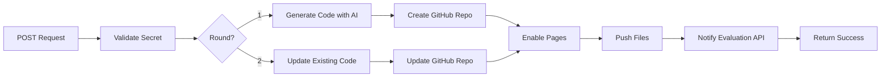

# TDS-Project-1-LLM-Code-Deployment

> Automated web application deployment using AI - Just describe what you want, and watch it deploy to GitHub Pages automatically!

[](https://www.python.org/downloads/)
[](https://fastapi.tiangolo.com/)
[](https://opensource.org/licenses/MIT)

## 🌟 Overview

This system accepts natural language descriptions of web applications, generates complete HTML/CSS/JS code using Claude AI, and automatically deploys them to GitHub Pages. It supports iterative updates and generates professional documentation.

**Live Demo:** Send a POST request and get a deployed app in under 2 minutes! ⚡

## ✨ Features

- 🤖 **AI-Powered Generation** - Claude Sonnet 4.5 generates production-ready code
- 📦 **One-Click Deployment** - Automatic GitHub repo creation and Pages setup
- 🔄 **Iterative Updates** - Modify apps based on feedback (Round 2 support)
- 📝 **Auto Documentation** - Professional README generation
- 🎨 **Modern Design** - Tailwind CSS, responsive, animated UIs
- 🔐 **Secure** - Secret-based authentication
- ♻️ **Retry Logic** - Robust error handling with exponential backoff
- ⚖️ **MIT Licensed** - All generated repos include MIT license

## 🎯 Use Cases

- Quick prototyping and MVPs
- Landing pages and marketing sites
- Portfolio projects
- Educational demonstrations
- Hackathon projects
- Client mockups

## 📋 Prerequisites

- Python 3.11 or higher
- GitHub account
- GitHub Personal Access Token ([Get one here](https://github.com/settings/tokens))
- AIPIPE API Key ([Sign up](https://aipipe.ai))

## 🚀 Quick Start

### 1. Clone & Setup

```bash
git clone https://github.com/yourusername/llm-code-deployment.git
cd llm-code-deployment

# Create virtual environment
python -m venv .venv
source .venv/bin/activate  # Windows: .venv\Scripts\activate

# Install dependencies
pip install fastapi uvicorn requests python-dotenv
```

### 2. Configure Environment

Create `.env` file:

```env
GITHUB_TOKEN=ghp_xxxxxxxxxxxxxxxxxxxx
AIPIPE_API_KEY=your_aipipe_key_here
SECRET=my_secret_phrase
```

**Get GitHub Token:**
1. Go to [GitHub Settings → Developer settings → Personal access tokens](https://github.com/settings/tokens)
2. Generate new token (classic)
3. Select scopes: `repo`, `workflow`, `pages`
4. Copy token (starts with `ghp_`)

**Update Username:**
Edit `main.py` line 17:
```python
GITHUB_USERNAME = "yourusername"  # Change this!
```

### 3. Run Server

```bash
python main.py
```

Server starts on `http://localhost:8000` 🎉

## 💻 Usage

### Example 1: Create Landing Page

```bash
curl http://localhost:8000/handle_task \
  -H "Content-Type: application/json" \
  -d '{
    "email": "yourname@example.com",
    "secret": "my_secret_phrase",
    "task": "landing-page",
    "round": 1,
    "nonce": "unique123",
    "brief": "Create a modern SaaS landing page with hero section, features grid, pricing table, and contact form",
    "checks": [
      "Responsive design",
      "Smooth animations",
      "Professional typography"
    ],
    "evaluation_url": "https://example.com/callback",
    "attachments": []
  }'
```

**Result:** 
- Repo: `https://github.com/yourusername/landing-page_unique123`
- Live: `https://yourusername.github.io/landing-page_unique123/`

### Example 2: Update with New Features

```bash
curl http://localhost:8000/handle_task \
  -H "Content-Type: application/json" \
  -d '{
    "email": "yourname@example.com",
    "secret": "my_secret_phrase",
    "task": "landing-page",
    "round": 2,
    "nonce": "unique123",
    "brief": "Add a testimonials section with carousel and newsletter signup",
    "checks": [
      "Working carousel",
      "Email validation"
    ],
    "evaluation_url": "https://example.com/callback",
    "attachments": []
  }'
```

### Python Example

```python
import requests

response = requests.post("http://localhost:8000/handle_task", json={
    "email": "developer@example.com",
    "secret": "my_secret_phrase",
    "task": "portfolio-2024",
    "round": 1,
    "nonce": "abc123",
    "brief": "Personal portfolio with dark mode, project showcase, skills section, and contact form",
    "checks": [
        "Dark mode toggle works",
        "Projects displayed in grid",
        "Contact form validates inputs"
    ],
    "evaluation_url": "https://example.com/notify",
    "attachments": []
})

print(response.json())
# {"message": "Round 1 completed successfully"}
```

## 📡 API Reference

### POST `/handle_task`

**Request Body:**

```json
{
  "email": "string",           // Your email
  "secret": "string",          // Must match .env SECRET
  "task": "string",            // Unique task ID
  "round": 1 | 2,              // 1=create, 2=update
  "nonce": "string",           // Unique nonce
  "brief": "string",           // App description
  "checks": ["string"],        // Evaluation criteria
  "evaluation_url": "string",  // Callback URL
  "attachments": [...]         // Optional files
}
```

**Success Response:**
```json
{
  "message": "Round 1 completed successfully"
}
```

**Error Response:**
```json
{
  "error": "Invalid secret"
}
```

## 🏗️ Architecture



## 🛠️ Technology Stack

- **Backend:** FastAPI, Uvicorn
- **AI Model:** Claude Sonnet 4.5 via AIPIPE
- **Deployment:** GitHub Pages
- **Version Control:** GitHub API
- **Frontend:** HTML5, Tailwind CSS, Vanilla JavaScript
- **Environment:** Python 3.11+

## 📁 Project Structure

```
llm-code-deployment/
├── main.py                 # Core application
├── .env                    # Environment variables (git-ignored)
├── .gitignore             # Git ignore rules
├── requirements.txt       # Python dependencies
├── README.md              # This file
└── examples/
    └── send_task.py       # Example request script
```

## 🔧 Configuration

### Environment Variables

| Variable | Description | Example |
|----------|-------------|---------|
| `GITHUB_TOKEN` | GitHub PAT with repo access | `ghp_xxxxx` |
| `AIPIPE_API_KEY` | AIPIPE API key | `sk_xxxxx` |
| `SECRET` | Authentication secret | `my_secret_123` |

### Customization

**Change AI Model:**
```python
# In llm_generate() function
"model": "claude-sonnet-4-5-20250929",  # Change this
```

**Adjust Timeout/Retries:**
```python
# In notify_evaluation() function
for delay in [1, 2, 4, 8]:  # Modify retry delays
```

## 🐛 Troubleshooting

<details>
<summary><b>❌ "Invalid secret" error</b></summary>

- Check `.env` has `SECRET=your_value`
- Verify request uses same secret
- Restart server after changing `.env`
- Check for hidden spaces/newlines
</details>

<details>
<summary><b>❌ GitHub API failures</b></summary>

- Verify token permissions: `repo`, `workflow`, `pages`
- Check token hasn't expired
- Ensure unique repository name
- Wait 2-3 seconds between API calls
</details>

<details>
<summary><b>❌ AIPIPE errors</b></summary>

- Validate API key is active
- Check rate limits/quota
- Review error message details
- Try again in a few minutes
</details>

<details>
<summary><b>❌ Pages not loading</b></summary>

- Wait 2-3 minutes for GitHub Pages build
- Check repo Settings → Pages is enabled
- Verify `index.html` exists in main branch
- Check browser console for errors
</details>

## 📊 Example Applications Generated

| Task | Description | Demo |
|------|-------------|------|
| Portfolio | Personal portfolio site | [View](https://yourusername.github.io/portfolio/) |
| Landing | SaaS landing page | [View](https://yourusername.github.io/landing/) |
| Calculator | Web calculator | [View](https://yourusername.github.io/calc/) |
| Dashboard | Analytics dashboard | [View](https://yourusername.github.io/dash/) |

## 🤝 Contributing

Contributions welcome! Please:

1. Fork the repository
2. Create feature branch (`git checkout -b feature/amazing`)
3. Commit changes (`git commit -m 'Add amazing feature'`)
4. Push to branch (`git push origin feature/amazing`)
5. Open Pull Request

## 📝 License

MIT License - see [LICENSE](LICENSE) file for details.

## 👨‍💻 Author

**Your Name**
- GitHub: [@yourusername](https://github.com/yourusername)
- Email: your.email@example.com

## 🙏 Acknowledgments

- [Anthropic Claude](https://anthropic.com) for AI capabilities
- [AIPIPE](https://aipipe.ai) for API access
- [FastAPI](https://fastapi.tiangolo.com/) for the web framework
- [GitHub Pages](https://pages.github.com/) for hosting

## 📈 Project Status

🟢 **Active Development** - Accepting issues and PRs

### Roadmap

- [ ] Support for React/Vue components
- [ ] Multiple file uploads
- [ ] Custom domain configuration
- [ ] Database integration
- [ ] Analytics dashboard
- [ ] CLI tool

---

<div align="center">

**⭐ Star this repo if you find it helpful!**

Made with ❤️ and 🤖 AI

</div>
